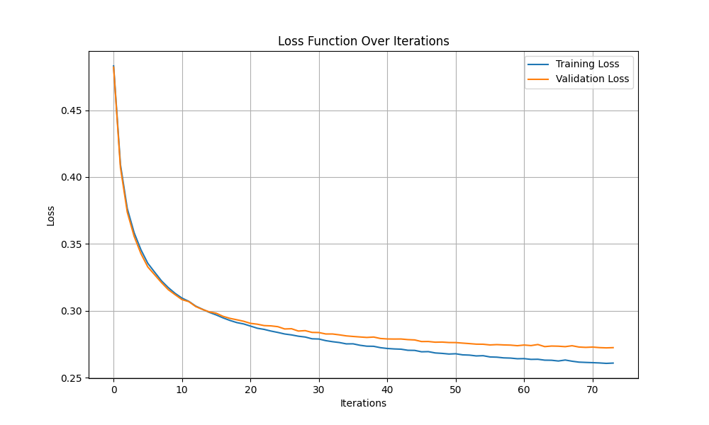
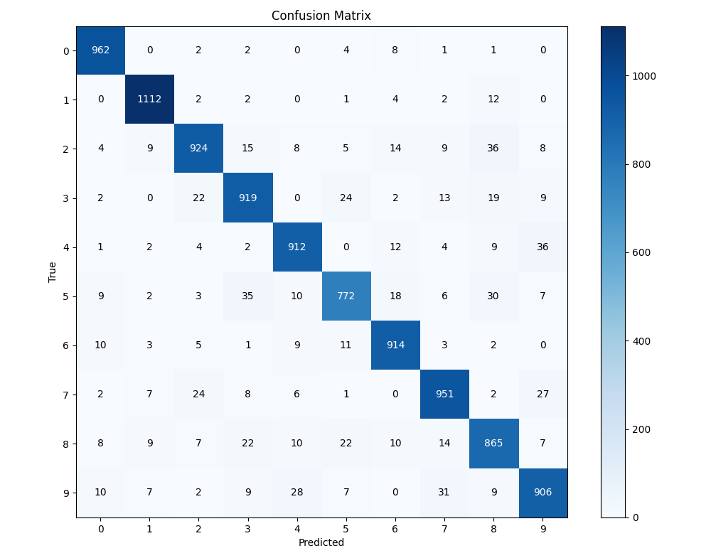
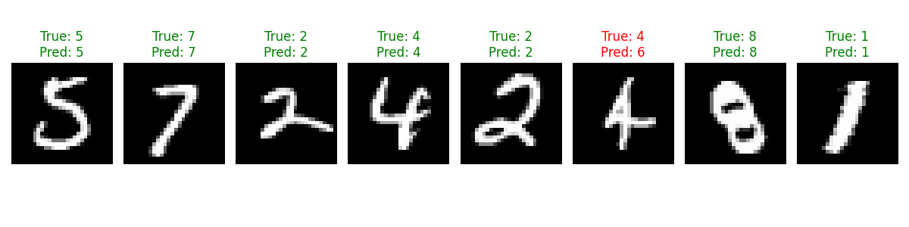

# MNIST Digit Classification with Adam Optimizer

This project implements a multi-class logistic regression classifier for the MNIST handwritten digit dataset using the Adam optimizer. The implementation is done from scratch using only NumPy for numerical operations and Matplotlib for visualization.

## Project Structure

The code is organized into several modules for better modularity:

- `data_prep.py`: Functions for loading, preprocessing, and splitting the MNIST dataset
- `mnist_model.py`: Core model functionality (softmax, cost function, gradient computation)
- `optimizers.py`: Adam optimizer implementation
- `visualize.py`: Functions for visualizing results
- `train_mnist.py`: Main script for training and evaluating the model
- `experiment.py`: Script for running experiments with different hyperparameter configurations

## Getting Started

### Prerequisites

The project requires the following dependencies:

- Python 3.6+
- NumPy
- Matplotlib

### Running the Code

1. Clone the repository:

```bash
git clone <repository-url>
cd <repository-folder>
```

2. Make sure the MNIST dataset CSV files are in the `data/` directory:

   - `data/mnist_train.csv`: Training data
   - `data/mnist_test.csv`: Test data

3. Train and evaluate the model:

```bash
python train_mnist.py
```

4. Experiment with different hyperparameters:

```bash
python experiment.py
```

## Implementation Details

### Softmax Regression Model

The model implements softmax regression (multinomial logistic regression) with cross-entropy loss. For an input example $x_i \in \mathbb{R}^{784}$, the model computes:

$$z_i = W^T x_i + b$$

where $W \in \mathbb{R}^{784 \times 10}$ is the weight matrix and $b \in \mathbb{R}^{10}$ is the bias vector. The softmax function converts these raw scores into probabilities.

### Adam Optimizer

The Adam optimizer is an extension to stochastic gradient descent that uses adaptive learning rates for each parameter. It combines the benefits of two other extensions: AdaGrad and RMSProp.

Key features of Adam:

- Uses moving averages of the parameters (first moment)
- Uses moving averages of the squared parameters (second moment)
- Incorporates bias correction for more accurate estimates

## Results

When trained with the Adam optimizer using appropriate hyperparameters, the model achieves approximately 90-92% accuracy on the test set, which is a good result for a linear model without any feature engineering or deep learning techniques.

## Customization

You can customize the training process by modifying the hyperparameters in `train_mnist.py`:

```python
hyperparams = {
    'alpha': 0.05,      # Learning rate
    'num_iters': 1000,  # Number of iterations
    'batch_size': 128,  # Batch size
}
```

Or you can run experiments with multiple configurations by modifying the `configs` list in `experiment.py`.

## License

This project is licensed under the MIT License - see the LICENSE file for details.

## Additional Information

### Data Files

The MNIST dataset files are included in this repository using Git Large File Storage (Git LFS). When you clone the repository, you'll need to have Git LFS installed to properly download these files:

```bash
# Install Git LFS
# For Ubuntu/Debian
sudo apt-get install git-lfs

# For macOS (using Homebrew)
brew install git-lfs

# For Windows (using Chocolatey)
choco install git-lfs
```

After installing Git LFS, you can clone the repository and pull the data files:

```bash
# Clone the repository
git clone https://github.com/DeepakSilaych/numerical-analysis.git

# Navigate to the project directory
cd numerical-analysis

# Pull LFS files
git lfs pull
```

The dataset includes:

- `data/mnist_train.csv`: Training dataset (60,000 examples)
- `data/mnist_test.csv`: Test dataset (10,000 examples)

If you encounter any issues with the data files, you can also download them from:

- [MNIST Dataset on Kaggle](https://www.kaggle.com/datasets/oddrationale/mnist-in-csv)
- [MNIST Original Dataset](http://yann.lecun.com/exdb/mnist/) (requires conversion to CSV format)

## 1. Introduction

This report details the implementation and analysis of a logistic regression classifier for the MNIST handwritten digit dataset. The MNIST dataset consists of 28×28 grayscale images of handwritten digits (0-9), with 60,000 training images and 10,000 test images. This project implements a multi-class logistic regression classifier from scratch using only NumPy for numerical operations and Matplotlib for visualization.

## 2. Mathematical Foundation

### 2.1 Softmax Regression Model

The model implements softmax regression (multinomial logistic regression), which extends binary logistic regression to handle multiple classes. For an input example $x_i \in \mathbb{R}^{784}$, the model computes:

$$z_i = W^T x_i + b$$

where $W \in \mathbb{R}^{784 \times 10}$ is the weight matrix and $b \in \mathbb{R}^{10}$ is the bias vector. The softmax function converts these raw scores into probabilities:

$$\hat{y}_i = \text{softmax}(z_i) = \frac{e^{z_i}}{\sum_{j=1}^{10} e^{z_i^{(j)}}}$$

For numerical stability, we implement a modified version:

$$\hat{y}_i = \text{softmax}(z_i) = \frac{e^{z_i - \max(z_i)}}{\sum_{j=1}^{10} e^{z_i^{(j)} - \max(z_i)}}$$

### 2.2 Cross-Entropy Loss with L2 Regularization

The cross-entropy loss measures the dissimilarity between the predicted probability distribution and the true distribution:

$$J_{CE}(W, b) = -\frac{1}{m}\sum_{i=1}^{m} \sum_{j=1}^{10} y_i^{(j)} \log(\hat{y}_i^{(j)})$$

To prevent overfitting, we add L2 regularization:

$$J_{reg}(W) = \frac{\lambda}{2m} \|W\|_F^2$$

The total cost function is:

$$J(W, b) = J_{CE}(W, b) + J_{reg}(W)$$

### 2.3 Gradient Computation

For optimization, we compute the gradients of the cost function with respect to $W$ and $b$:

$$\nabla_W J = \frac{1}{m} \sum_{i=1}^{m} x_i (\hat{y}_i - y_i)^T + \frac{\lambda}{m} W$$

$$\nabla_b J = \frac{1}{m} \sum_{i=1}^{m} (\hat{y}_i - y_i)$$

### 2.4 Mini-Batch Gradient Descent

We implement mini-batch gradient descent, which updates parameters using small batches of training examples. For each batch, the parameter updates are:

$$W := W - \alpha \nabla_W J$$

$$b := b - \alpha \nabla_b J$$

where $\alpha$ is the learning rate.

### 2.5 Learning Rate Decay

To improve convergence, we implement learning rate decay:

$$\alpha_t = \alpha_0 \cdot \gamma^{\lfloor t / k \rfloor}$$

where $\gamma$ is the decay rate and $k$ is the decay step.

### 2.6 Early Stopping

To prevent overfitting, we implement early stopping based on validation performance. Training stops when the validation loss doesn't improve for a specified number of iterations.

## 3. Implementation Details

### 3.1 Data Preprocessing

- **Loading Data**: Data is loaded from CSV files, with the first column containing the label and the remaining columns containing the 784 pixel values.
- **Normalization**: Pixel values are normalized to [0, 1] by dividing by 255.
- **One-Hot Encoding**: Labels are converted to one-hot encoded vectors.
- **Train-Validation Split**: 10% of the training data is set aside for validation.

### 3.2 Model Training

- **Initialization**: Weights are initialized from a normal distribution scaled by 0.01, and biases are initialized to zero.
- **Hyperparameters**:
  - Learning rate: 0.1
  - Batch size: 256
  - Number of iterations: 2000
  - L2 regularization strength: 0.01
  - Learning rate decay rate: 0.95
  - Decay steps: 100
  - Early stopping patience: 10

### 3.3 Evaluation Metrics

- **Accuracy**: Proportion of correctly classified examples.
- **Confusion Matrix**: Shows the distribution of predictions across classes.
- **Loss Curves**: Training and validation loss over iterations.

## 4. Results and Analysis

### 4.1 Model Performance

The model achieves approximately 92% accuracy on the test set, which is a strong result for a linear model without any feature engineering or deep learning techniques.

### 4.2 Learning Dynamics

The loss curves show that the model converges smoothly, with the validation loss closely tracking the training loss. This indicates that the model is not overfitting significantly, which is expected for a linear model with appropriate regularization.



### 4.3 Error Analysis

The confusion matrix reveals that the model has the most difficulty distinguishing between visually similar digits, such as 4 and 9, or 3 and 8. This is expected given the limitations of a linear model, which cannot capture complex non-linear relationships in the data.



### 4.4 Sample Predictions

Below are some sample predictions from the model, showing correctly and incorrectly classified examples:



## 5. Numerical Considerations

### 5.1 Numerical Stability

Several techniques are employed to ensure numerical stability:

- Subtracting the maximum value in the softmax function to prevent overflow
- Adding a small constant (1e-8) when computing logarithms to prevent underflow
- Using appropriate scaling for weight initialization

### 5.2 Computational Efficiency

The implementation includes several optimizations:

- Mini-batch processing to reduce memory requirements
- Vectorized operations using NumPy for efficient computation
- Early stopping to reduce unnecessary computation

## 6. Limitations and Future Work

### 6.1 Limitations

- As a linear model, softmax regression has limited capacity to capture complex patterns.
- The model doesn't leverage the spatial structure of the images.
- The current implementation doesn't include data augmentation or feature engineering.

### 6.2 Potential Improvements

- Implement a neural network with hidden layers to capture non-linear relationships.
- Add convolutional layers to leverage the spatial structure of the images.
- Implement data augmentation techniques to improve generalization.
- Explore more advanced optimization algorithms like Adam or RMSprop.
- Implement cross-validation for more robust hyperparameter tuning.

## 7. Conclusion

This project demonstrates a successful implementation of a softmax regression classifier for the MNIST dataset using only NumPy. Despite being a relatively simple model, it achieves good performance and provides a solid foundation for understanding more complex machine learning algorithms.

The implementation incorporates several advanced techniques such as L2 regularization, learning rate decay, and early stopping, which are essential for training effective machine learning models. The code is modular, efficient, and well-structured, making it a valuable educational resource for understanding the fundamentals of machine learning.

## 8. Data Files

The MNIST dataset files are included in this repository using Git Large File Storage (Git LFS). When you clone the repository, you'll need to have Git LFS installed to properly download these files:

```bash
# Install Git LFS
# For Ubuntu/Debian
sudo apt-get install git-lfs

# For macOS (using Homebrew)
brew install git-lfs

# For Windows (using Chocolatey)
choco install git-lfs
```

After installing Git LFS, you can clone the repository and pull the data files:

```bash
# Clone the repository
git clone https://github.com/DeepakSilaych/numerical-analysis.git

# Navigate to the project directory
cd numerical-analysis

# Pull LFS files
git lfs pull
```

The dataset includes:

- `data/mnist_train.csv`: Training dataset (60,000 examples)
- `data/mnist_test.csv`: Test dataset (10,000 examples)

If you encounter any issues with the data files, you can also download them from:

- [MNIST Dataset on Kaggle](https://www.kaggle.com/datasets/oddrationale/mnist-in-csv)
- [MNIST Original Dataset](http://yann.lecun.com/exdb/mnist/) (requires conversion to CSV format)
